# Restaurant Reservation and Ordering System

This project is a full-stack web application for managing restaurant reservations, menu items, orders, and user authentication. It features an admin dashboard, user profile management, and email confirmation for reservations.

## Deployment

You can deploy this project to platforms like  [Render](https://render.com/)

Link:-  https://pr-restaurant-website-node-js.onrender.com

## Screenshots

### User Screens

#### Signup
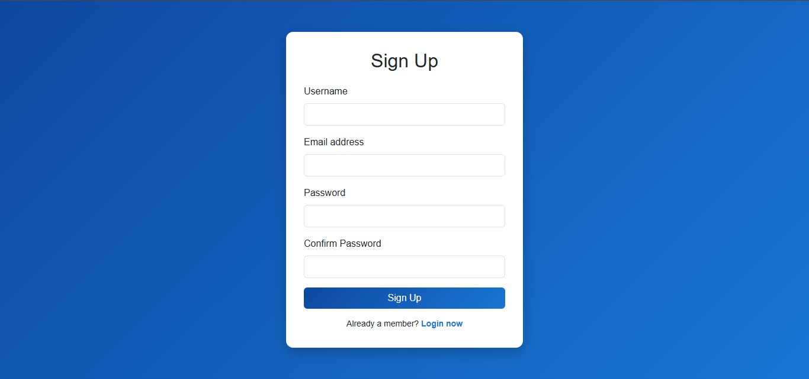

#### Login
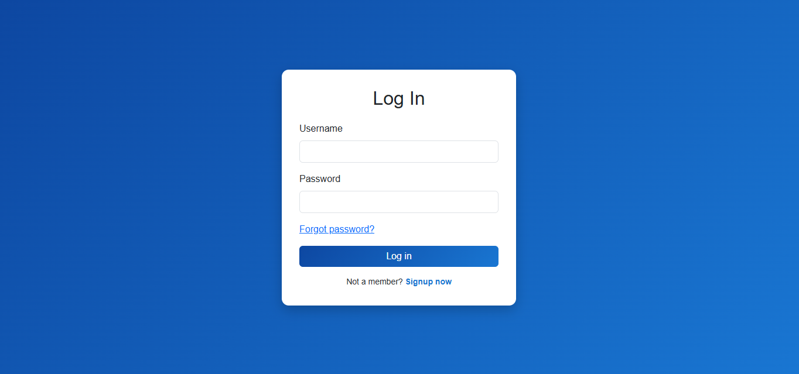

#### Home Page
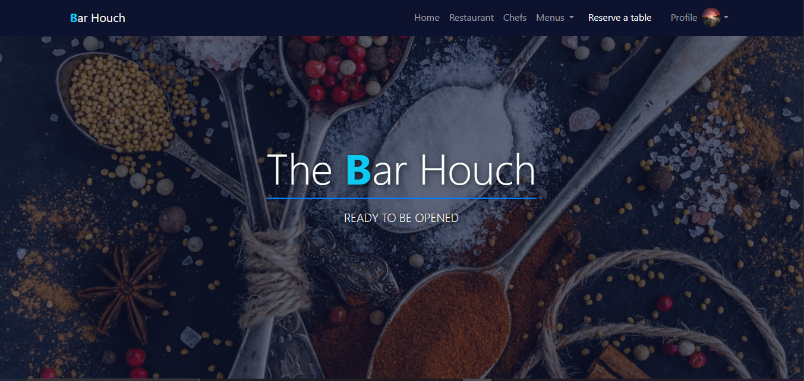

#### Category Menu
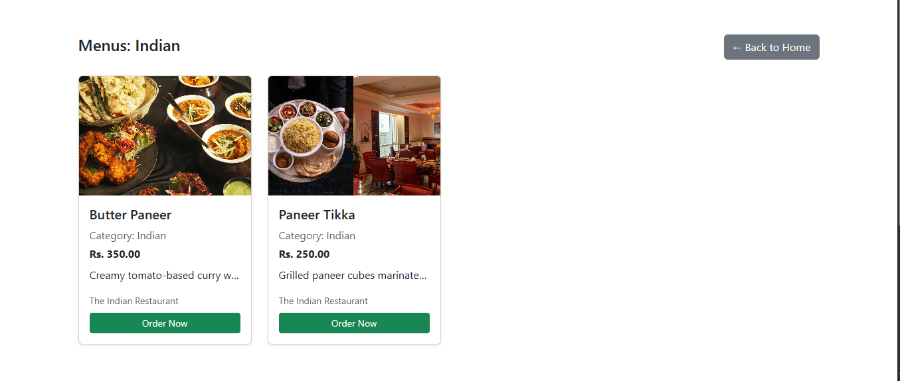

#### Menu
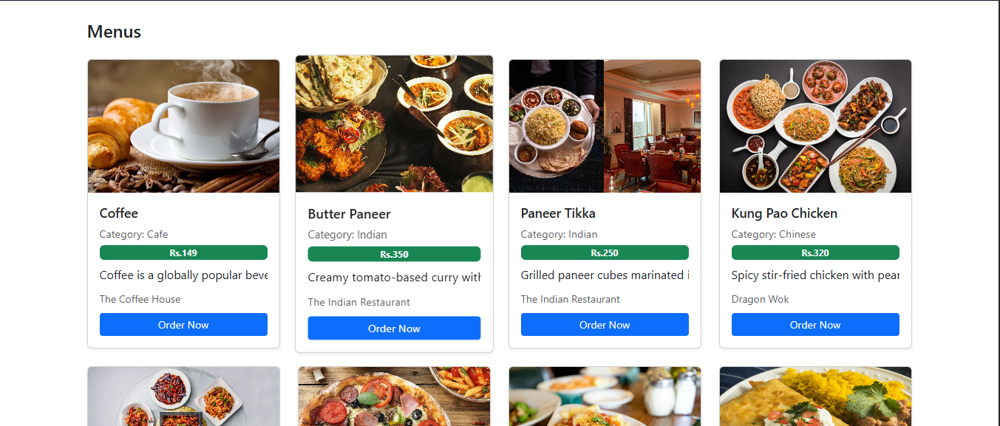

#### Menu List
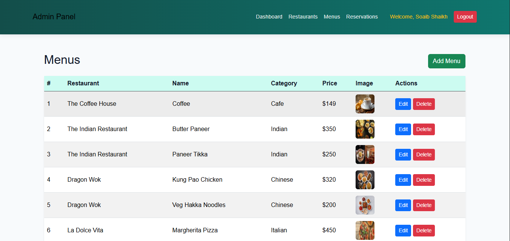

#### Reservation Form
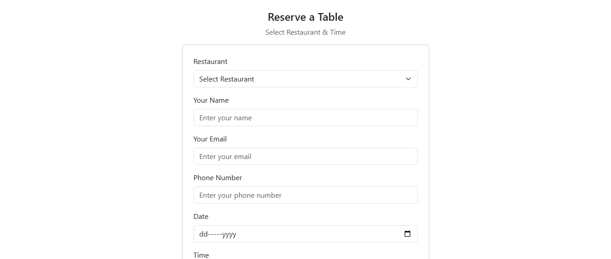

#### Reservation
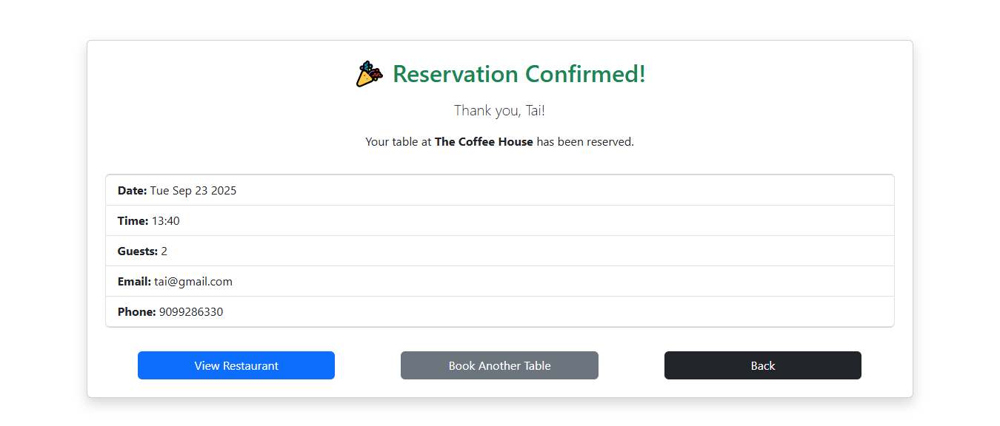

#### Restaurant
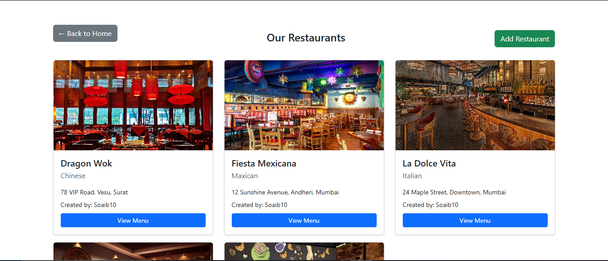

### Admin Screens

#### Admin Home
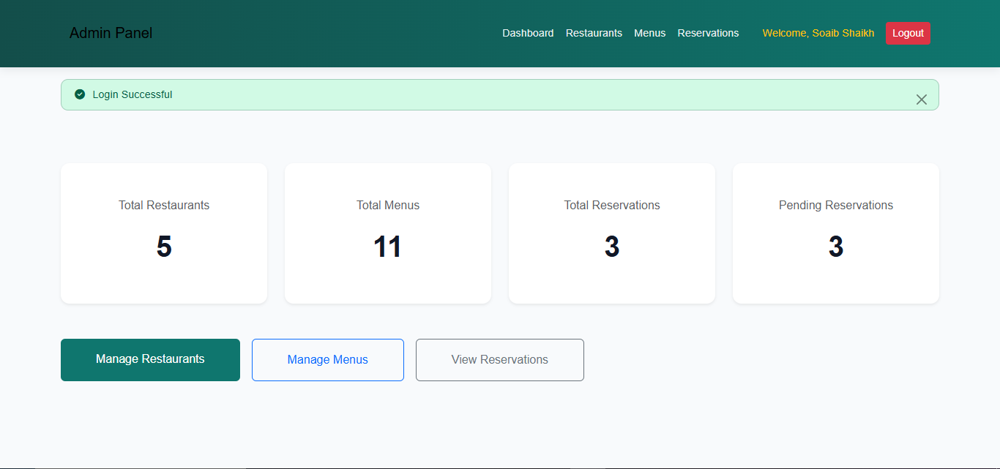

#### Add Restaurant
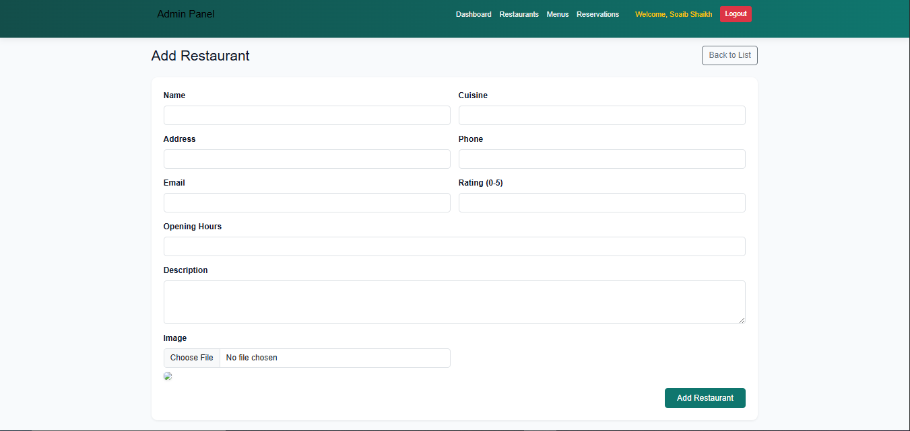

#### Admin Restaurant Management
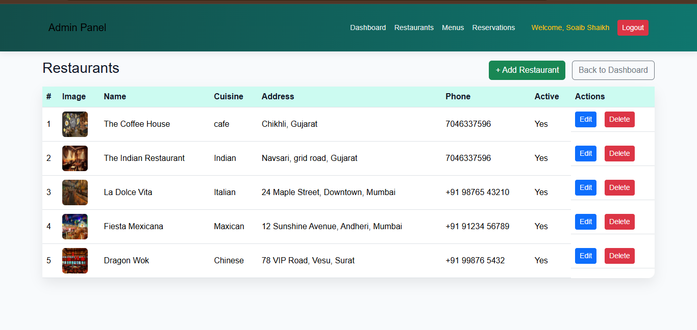

#### Add Menu
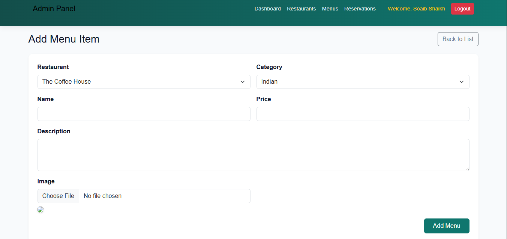

#### Reservations Manage
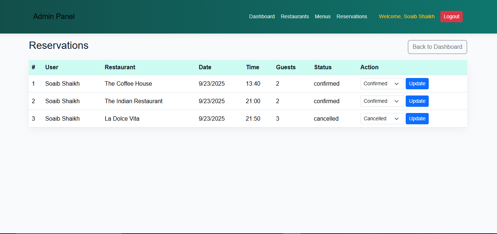

## Features

- User registration, login, and profile management
- Admin dashboard for managing menus, restaurants, orders, and reservations
- Menu browsing and ordering
- Table reservation system
- Email confirmation for reservations
- File uploads for menu and restaurant images

## Usage

- **User Registration & Login:**
	- Sign up as a new user and verify your email.
	- Log in to access your profile, make reservations, and place orders.
- **Menu Browsing & Ordering:**
	- Browse restaurant menus and add items to your order.
	- Place orders and view order details.
- **Table Reservation:**
	- Reserve a table at your preferred restaurant and receive email confirmation.
	- View and manage your reservations in the "My Reservations" section.
- **Admin Dashboard:**
	- Log in as admin to manage restaurants, menus, orders, and reservations.
	- Add, edit, or remove menu items and restaurants.
	- View all reservations and orders placed by users.

## Technologies Used
- Node.js
- Express.js
- MongoDB (Mongoose)
- EJS (Embedded JavaScript Templates)
- Passport.js (Authentication)
- Multer (File uploads)
- Nodemailer (Email sending)

## Project Structure
- `controllers/` - Route controllers for admin, user, menu, order, reservation, and restaurant
- `models/` - Mongoose schemas for users, menus, orders, reservations, and restaurants
- `middlewares/` - Custom middleware for authentication, file uploads, and more
- `routers/` - Express route definitions
- `views/` - EJS templates for all pages and dashboards
- `public/` - Static assets (CSS, images, uploads)
- `configs/` - Database and other configuration files
- `index.js` - Main server entry point

## Getting Started
1. Clone the repository
2. Run `npm install` to install dependencies
3. Set up your MongoDB connection in `configs/db.js`
4. Start the server with `node index.js` or `npm start`
5. Visit `http://localhost:3000` in your browser

## Admin Credentials
- **Username:** Soaib10
- **Password:** Soaib1002

## License
This project is for educational purposes.
